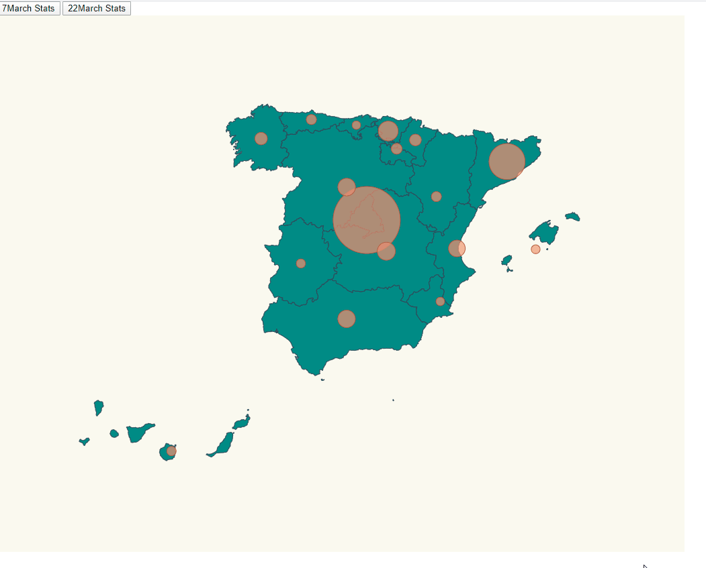

# SPAIN----------COVID-19----------

I have to show the map of Spain with each region, with the number of infected for coronavirus.
I have added:
	- Two bottons with the day of I want to show the afected.
	- Circles for each region depending the size for the number of infected.



This code is based on:

https://github.com/Lemoncode/d3js-typescript-examples/tree/master/02-maps/02-pin-location-scale

We have to face three challenges here:

- Place pins on a map based on location.
- Scale pin radius based on affected number.

# STEPS

# Installation

- Using the examples of "Lemoncode". 02-pin-location-scale, let's copy the content from that folder and execute _npm install_.

```bash
npm install
```

```bash
npm start
```
# Exercise

- This time we will Spain topojson info: https://github.com/deldersveld/topojson/blob/master/countries/spain/spain-comunidad-with-canary-islands.json. 
Let's copy it under the following route _./src/spain.json

- Import everything neccesary into our index.ts:

_./src/index.ts

```typescript
import * as d3 from "d3";
import * as topojson from "topojson-client";
const spainjson = require("./spain.json");
const d3Composite = require("d3-composite-projections");
import { latLongCommunities } from "./communities";
import {  InitialInfected_stats, FinalInfected_stats, DataEntry} from "./stats";
```

- Inserting bottons in:

_./src/index.html

```typescript
<body>
    <div>
      <button id="Initial">7March Stats</button>
      <button id="Final">22March Stats</button>
    </div>
    <script src="./index.ts"></script>
  </body>
```
_./src/index.ts

```typescript
 document
  .getElementById("Initial")
  .addEventListener("click", function handleCurrentResults(){
    console.log("incial")
    changeMap(InitialInfected_stats);
  });

document
  .getElementById("Final")
  .addEventListener("click", function handleCurrentResults(){
    console.log("final");
    changeMap(FinalInfected_stats);
  });
```

- I have added the stats of affected by covid 19 in:
	
	- 7/March/2020 ("Initial Infected")
	- 22/March/2020 ("Final Infected")


_./stats.ts_

```typescript
export const InitialInfected_stats: DataEntry[] = [
  {
    name: "Madrid",
    value: 587
  },
  {
    name: "La Rioja",
    value: 102
  },
  {
    name: "Andalucía",
    value: 54
  },
  {
    name: "Cataluña",
    value: 101
  },
  {
    name: "Valencia",
    value: 50
  },
  {
    name: "Murcia",
    value: 5
  },
  {
    name: "Extremadura",
    value: 7
  },
  {
    name: "Castilla La Mancha",
    value: 26
  },
  {
    name: "País Vasco",
    value: 148
  },
  {
    name: "Cantabria",
    value: 12
  },
  {
    name: "Asturias",
    value: 10
  },
  {
    name: "Galicia",
    value: 18
  },
  {
    name: "Aragón",
    value: 32
  },
  {
    name: "Castilla y León",
    value: 40
  },
  {
    name: "Islas Canarias",
    value: 24
  },
  {
    name: "Islas Baleares",
    value: 11
  },
  {
    name: "Navarra",
    value: 13
  }
];

export const FinalInfected_stats: DataEntry[] = [
  {
    name: "Madrid",
    value: 9702
  },
  {
    name: "La Rioja",
    value: 654
  },
  {
    name: "Andalucía",
    value: 1725
  },
  {
    name: "Cataluña",
    value: 4704
  },
  {
    name: "Valencia",
    value: 1604
  },
  {
    name: "Murcia",
    value: 296
  },
  {
    name: "Extremadura",
    value: 384
  },
  {
    name: "Castilla La Mancha",
    value: 1819
  },
  {
    name: "País Vasco",
    value: 2097
  },
  {
    name: "Cantabria",
    value: 282
  },
  {
    name: "Asturias",
    value: 545
  },
  {
    name: "Galicia",
    value: 915
  },
  {
    name: "Aragón",
    value: 532
  },
  {
    name: "Castilla y León",
    value: 1744
  },
  {
    name: "Islas Canarias",
    value: 414
  },
  {
    name: "Islas Baleares",
    value: 331
  },
  {
    name: "Navarra",
    value: 794
  }
];
```

- Now we want to display a circle in the middle of each community (comunidad autónoma),
  we have collected the latitude and longitude for each community, let's add them to our
  project.

_./src/communities.ts_

```typescript
export interface DataEntry {
  name: string;
  long: number;
  lat: number;
}

export const latLongCommunities: DataEntry[] = [
  {
    name: "Madrid",
    long: -3.70256,
    lat: 40.4165
  },
  {
    name: "Andalucía",
    long: -4.5,
    lat: 37.6
  },
  {
    name: "Valencia",
    long: -0.37739,
    lat: 39.45975
  },
  {
    name: "Murcia",
    long: -1.13004,
    lat: 37.98704
  },
  {
    name: "Extremadura",
    long: -6.16667,
    lat: 39.16667
  },
  {
    name: "Cataluña",
    long: 1.86768,
    lat: 41.82046
  },
  {
    name: "País Vasco",
    long: -2.75,
    lat: 43.0
  },
  {
    name: "Cantabria",
    long: -4.03333,
    lat: 43.2
  },
  {
    name: "Asturias",
    long: -5.86112,
    lat: 43.36662
  },
  {
    name: "Galicia",
    long: -7.86621,
    lat: 42.75508
  },
  {
    name: "Aragón",
    long: -1.0,
    lat: 41.0
  },
  {
    name: "Castilla y León",
    long: -4.45,
    lat: 41.383333
  },
  {
    name: "Castilla La Mancha",
    long: -3.000033,
    lat: 39.500011
  },
  {
    name: "Islas Canarias",
    long: -15.5,
    lat: 28.0
  },
  {
    name: "Islas Baleares",
    long: 2.52136,
    lat: 39.18969
  },
  {
    name: "La Rioja",
    long: -2.44373,
    lat: 42.4650
  },
  {
    name: "Navarra",
    long: -1.676069,
    lat: 42.695391
  }
];

```

- Now, adding the right size to be displayed in our screen:

_./src/index.ts_

```typescript		
const aProjection = d3Composite
  .geoConicConformalSpain()
  // Let's make the map bigger to fit in our resolution
  .scale(3000)
  // Let's center the map
  .translate([500, 400]);
```


- When the bottons is clicked, different attributes of the map must change:

_./src/index.ts_

```typescript
const changeMap = (data: DataEntry[]) =>{
   };

```

- Inside of this methods I need some functions to change de size of the circle by region:

	- Maximum number of affected .

_./src/index.ts_


```typescript
const maxAffected = data.reduce(
        (max, item) => (item.value > max ? item.value : max),
        0
      );
```
	- Create an scale to map affected to radius size.

_./src/index.ts_

```typescript
 const affectedRadiusScale = d3
    .scaleLinear()
    .domain([0, maxAffected])
    .clamp(true)
    .range([5, 50]);
```
	- Calculate Radius Based On Affected Cases .

_./src/index.ts_

```typescript
const calculateRadiusBasedOnAffectedCases = (comunidad: string) => {
      const entry = data.find(item => item.name === comunidad);
      return entry ? affectedRadiusScale(entry.value) : 0;
    };
```

	- Now, we can draw our circles: 

_./src/index.ts_

```typescript
const circles = svg.selectAll("circle")

    circles
      .data(latLongCommunities)
      .enter()
      .append("circle")
      .attr("class", "affected-marker")
      .attr("r", function(d){
        return calculateRadiusBasedOnAffectedCases(d.name)
      })
      .attr("cx", d => aProjection([d.long, d.lat])[0])
      .attr("cy", d => aProjection([d.long, d.lat])[1])
      .merge(circles as any)
      .transition()
      .duration(500)
      .attr("r",function(d){
        return calculateRadiusBasedOnAffectedCases(d.name)
      });

```


